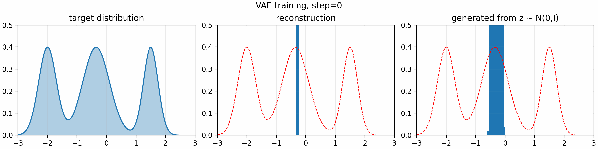
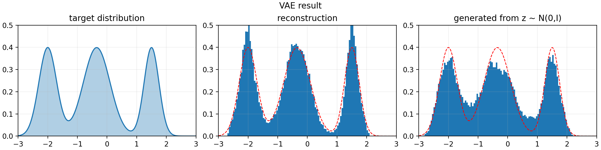

# mini VAE

A minimal 1D variational autoencoder (VAE) demo for learning the basic idea of variational inference, the reparameterization trick, and ELBO-style training.

The target data distribution is a simple mixture of three 1D Gaussians. The VAE learns to reconstruct samples from this distribution and generate new samples by decoding latent variables sampled from a standard normal distribution.

## Visualization

Training progress:



Final result:



## Model

The script uses:

- prior: `z ~ N(0, I)`
- encoder: `q_phi(z | x)`, outputting latent mean and log-variance
- decoder: `p_theta(x | z)`, implemented as a small MLP
- reconstruction loss: mean squared error
- KL regularization:

```text
KL(q_phi(z | x) || N(0, I))
```

The optimized loss is:

```text
loss = reconstruction_loss + beta * KL
```

where `beta = 0.1` in `main.py`.

## Setup

```bash
pip install numpy matplotlib torch pillow
```

## Run

```bash
python main.py
```

To save training progress, use `--save-frames`:

```bash
python main.py --save-frames
```

This saves one image every `1000` training steps and merges the frames into a 10 second GIF:

# Summary

The generated distribution may not perfectly match all modes of the target distribution. This project is intentionally small and educational, so the goal is to make the mechanics of a VAE easy to inspect rather than to achieve the best density model.

## References

- [Insightful explanation — Bilibili](https://www.bilibili.com/video/BV1Uj411Y7Zq/?spm_id_from=333.337.search-card.all.click&vd_source=25b9d402791c6cace8dfb973938b3a69)
- [From Autoencoder to Beta-VAE — Lilian Weng's blog](https://lilianweng.github.io/posts/2018-08-12-vae/)
- [Variational Autoencoders — Matthew N. Bernstein](https://mbernste.github.io/posts/vae/)
